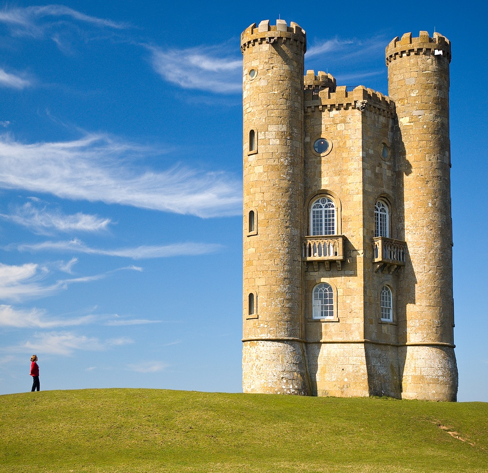

# seamCarving

## Description

Seam carving (or liquid rescaling) is an algorithm for content-aware image resizing, developed by Shai Avidan, of Mitsubishi Electric Research Laboratories (MERL), and Ariel Shamir, of the Interdisciplinary Center and MERL. It functions by establishing a number of seams (paths of least importance) in an image and automatically removes seams to reduce image size or inserts seams to extend it. Seam carving also allows manually defining areas in which pixels may not be modified, and features the ability to remove whole objects from photographs. 

* Original image


* Reduced width using seamCarving


## Built Using

* OpenCV
* Numpy

## How To Run

* To decrease width to 90%

```bash
bar@foo:~/seamCarving$ python3 carve.py <Image_path> -W 90 
```

* To increase width to 130%

```bash
bar@foo:~/seamCarving$ python3 carve.py <Image_path> -W 130 
```

**To apply similar operations on height, rotate the image by 90 degree and run**

## Author

* Vaibhav Garg